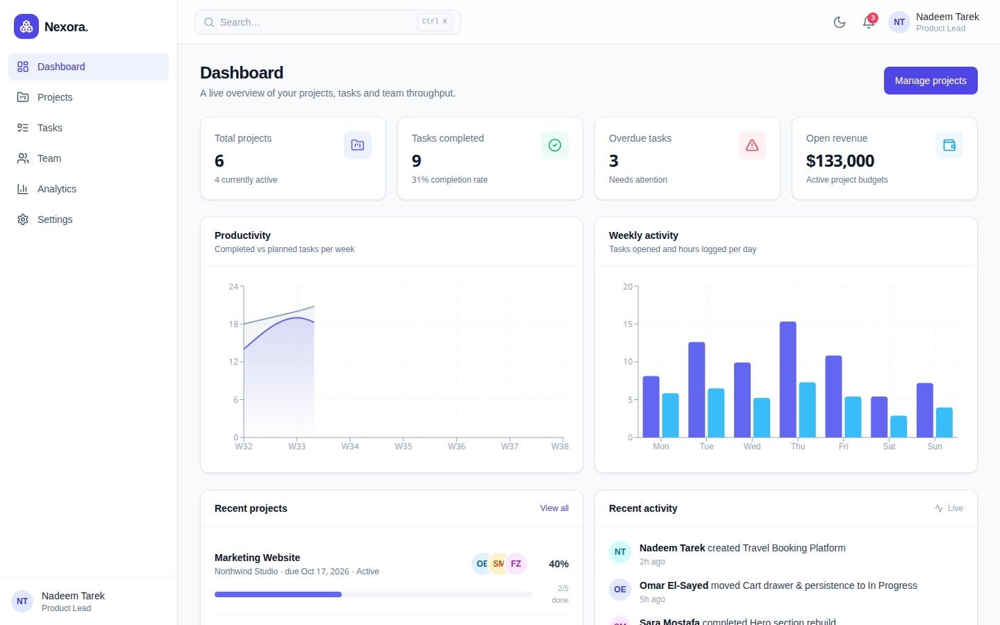
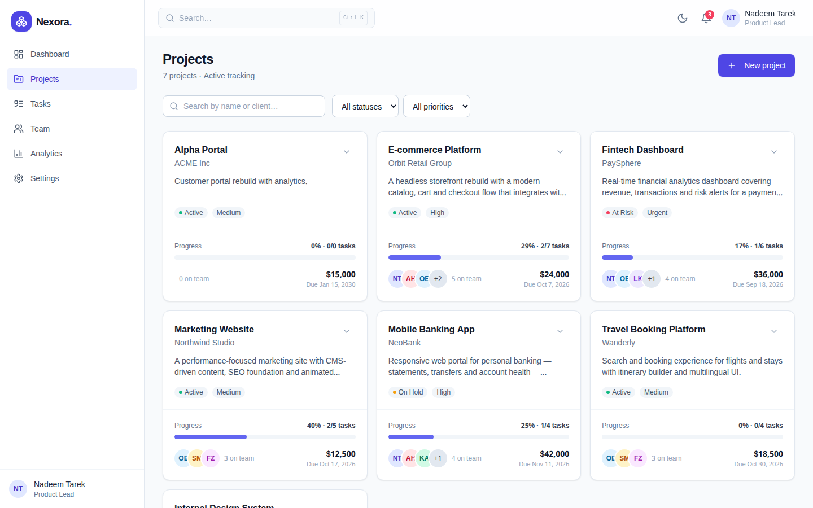
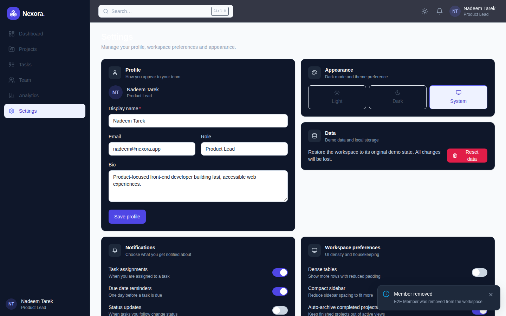
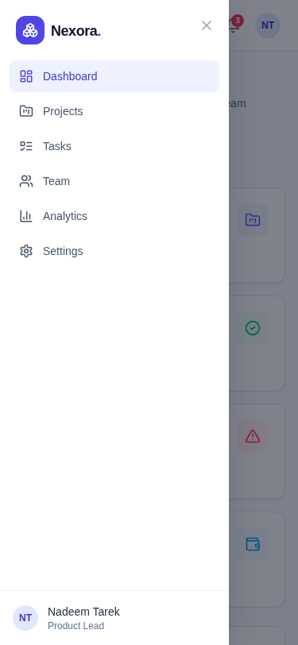
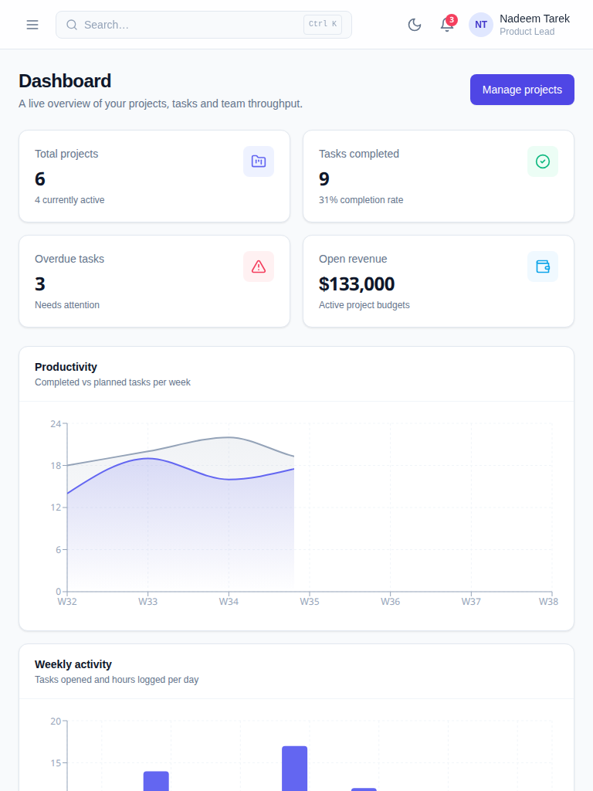

# NEXORA — SaaS Project Management Dashboard

A polished, fully client-side **project & task management dashboard** built as a portfolio piece. It demonstrates production-grade front-end work: strict TypeScript, real CRUD interactions, persisted state, dark mode, responsive layouts and an automated end-to-end test suite.



## Features

- **Pages** — Dashboard, Projects, Project Details, Tasks, Team, Analytics, Settings, 404.
- **Full CRUD** — create/edit/delete projects, tasks and team members with confirmation dialogs and toast feedback.
- **Task workflows** — status tabs with live counts, inline status changes, priority/project filters, and full-text search.
- **Analytics** — Recharts visualization (task distribution, weekly output, completion trends, per-project progress, per-member workload).
- **Dark mode** — light/dark/system themes with a live toggle.
- **Persistence** — Zustand stores persisted to `localStorage`; data survives reloads. One-click "Reset demo data" restores seeds.
- **Responsive** — verified at 375 / 768 / 1024 / 1440 px: off-canvas drawer below `lg`, table ↔ card switches, adaptive grids.
- **Accessibility** — skip-to-content link, semantic landmarks, labelled controls, focus-visible rings, `prefers-reduced-motion`, ARIA dialogs and toasts.
- **Performance** — lazy route chunks; Recharts is code-split so heavy charts only load where needed.

## Tech stack

| Layer | Choice |
|---|---|
| UI | React 18.3 + TypeScript 5.5 (strict, `noUnusedLocals`) |
| Build | Vite 5.4 + Tailwind CSS 3.4 |
| Routing | React Router 6.26 |
| State | Zustand 4.5 + `persist` middleware |
| Charts | Recharts 2.13 |
| Icons | lucide-react |
| Quality | ESLint (0 warnings) · Playwright E2E |

## Getting started

```bash
npm install
npm run dev        # http://localhost:5173
```

Production checks:

```bash
npm run typecheck  # strict TS, no errors
npm run lint       # eslint, max-warnings 0
npm run build      # tsc + vite build -> dist/
npm run preview    # serve dist/ (SPA fallback for deep links)
```

## Test results

The production build was exercised end-to-end with Playwright in headless Chromium at 375 / 768 / 1440 px widths, monitoring console errors, failed requests and uncaught exceptions across the whole session:

- **44 / 44 assertions passed**
- 0 console or network errors
- 0 uncaught page errors

Full details and results matrix: [PORTFOLIO_TEST_REPORT.md](PORTFOLIO_TEST_REPORT.md)

## Screenshots

| Desktop dashboard | Desktop projects | Dark mode settings |
|---|---|---|
|  |  |  |

| Mobile drawer (375px) | Tablet dashboard (768px) |
|---|---|
|  |  |

## Data

Ships with realistic mock data (6 projects, 8 team members, ~30 tasks) generated relative to today's date. All state is client-side — no backend, no accounts, no secrets.

---

Built with React, TypeScript, Vite and Tailwind CSS.